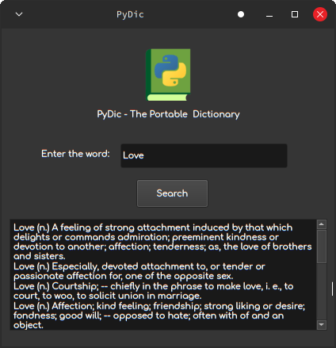

# pydic - A very portable and efficient offline dictionary!
<div align="center">
  
</div>
pydic is a dictionary search tool made using python and uses csv files of words from the dictionary as a databse. For the GUI it utilises PyQt. (Uses only a classic dictionary devoid of modern terms)

## Dependencies:
-> Linux (sorry windows users im too lazy :p)\
-> pip\
-> PyQt5\
-> pathlib\
To install the dependecies\
```pip install PyQt5 pathlib```

## Installation:
After installing the above dependencies just do\
```git clone https://github.com/Vjay15/pydic.git```\
Then move to the pydic directory where you need to make the python file scriptable\
```cd pydic```\
```chmod a+x pydic.sh```

## Usage:
To use the dictionary, open the terminal and do\
```cd pydic```\
```./pydic.sh```
